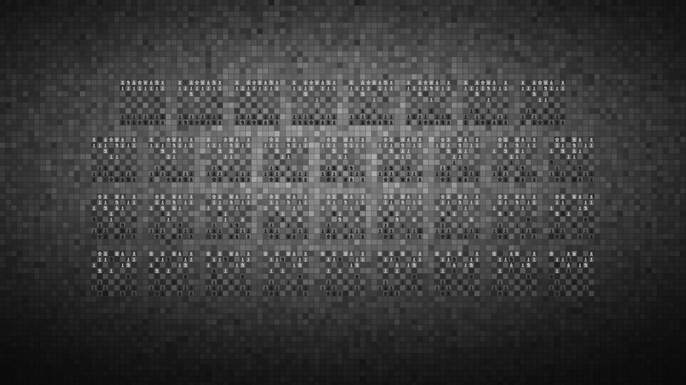

# chess_pgn_wallpaper
Python script to generate a 4k grayscale desktop background or wallpaper from a chess PGN "miniature" file of ~25 or fewer moves (~50 ply). 

Requires the Python Chess, Numpy, ImageIO SciPy, and Matplotlib libraries. All librariers except the chess library are included in the Anaconda distribution of Python. For the Chess library type "pip install python-chess" into a terminal or command prompt window once python has been installed.

After all dependencies are installed, ensure a .pgn file is in the "/pgns" folder and run the python script. After a few seconds a .png file with the same name as the .pgn file should appear in the directory of the "chess_pgn_wallpaper.py" script. Piece icons (found in the "/pieces" folder can be manually added. 

Five example wallpapers with their pgn files have been included in the repository:

## One of Greco's famous games against the infamous "nn"

## The classic miniature, the Opera game

## A quick win by Fisher

## A quick win by Carlsen

## The classic Budapest Gambit trap

